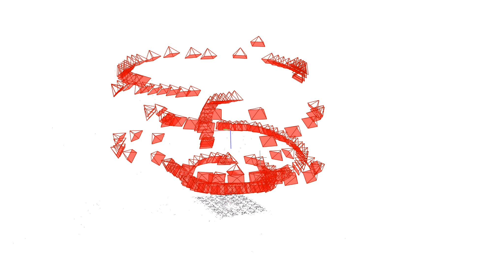
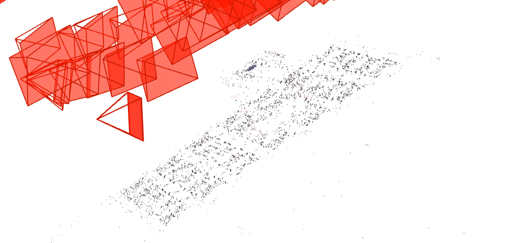
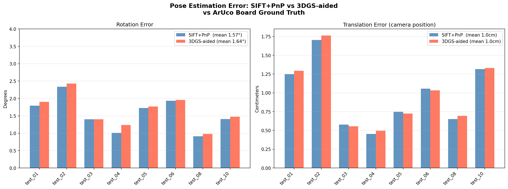
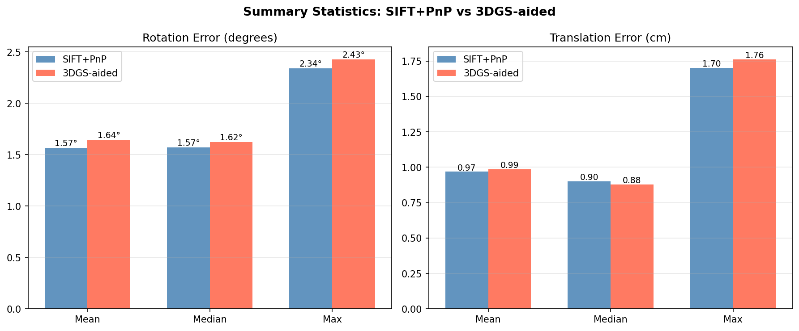
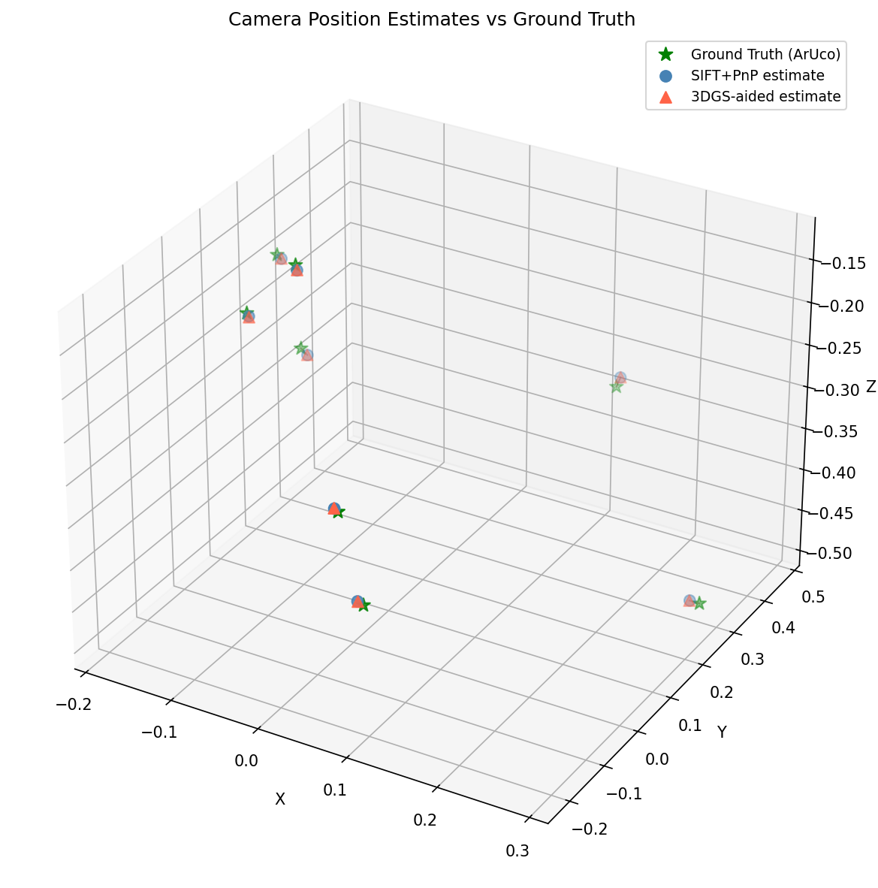

# SpaceChallenges-MLProject

# 6-DoF Pose Estimation: SIFT+PnP vs 3D Gaussian Splatting

**SpaceChallenges 2026 — Pascarel Alexandru-Nicolae**

A machine vision research project benchmarking a classical and a neural pose estimation
pipeline for non-cooperative object localization, motivated by the problem of autonomous
space debris capture.

---

## Motivation

There are roughly 27,000 pieces of trackable debris in orbit today. Missions such as
ESA's ClearSpace-1 must autonomously approach a tumbling, non-cooperative object — with
no GPS, no radio link, and no pre-known 3D model — and estimate its 6-DoF pose precisely
enough for robotic capture. This project builds and evaluates a small-scale prototype of
that perception pipeline, using a Rubik's cube as a surrogate object and an ArUco marker
board as the ground truth system.

---

## Experiment Overview

| Parameter | Value |
|-----------|-------|
| Target object | Standard 3×3 Rubik's cube (5.7 cm), acting as surrogate satellite |
| Ground truth | ArUco marker board (DICT_4X4_50, 5×7 layout, 3 cm markers) |
| Camera | Samsung Galaxy S24 — main 1× rear camera |
| Calibration | Android Camera2 API intrinsics (LENS_INTRINSIC_CALIBRATION) |
| Training images | 244/245 matched by COLMAP (99.59% registration rate) |
| Test images | 10 images at held-out orientations (GT available for 8/10) |
| Reconstruction | COLMAP + 3D Gaussian Splatting (splatfacto, 30,000 iterations) |
| Gaussians | 204,001 (after pruning) |
| Novel views rendered | 220 (used as retrieval database for the 3DGS pipeline) |

Two pipelines were compared:

1. **SIFT+PnP** — SIFT feature extraction, FLANN matching against training images,
   PnP RANSAC solved against the COLMAP sparse 3D point cloud.
2. **3DGS-aided** — SuperPoint+LightGlue retrieval against 220 Gaussian Splat renders,
   followed by the same PnP RANSAC backend.

---

## 3D Reconstruction (COLMAP)

The training images were reconstructed using COLMAP Structure-from-Motion, producing the
sparse point cloud that both pipelines rely on for final pose computation. The screenshots
below show two views of the reconstructed scene.




---

## Results





|  | SIFT+PnP | 3DGS-aided | Δ |
|--|----------|------------|---|
| Rotation mean | **1.57°** | 1.64° | +0.08° |
| Rotation median | **1.57°** | 1.62° | +0.05° |
| Rotation max | **2.34°** | 2.43° | +0.09° |
| Translation mean | **0.97 cm** | 0.99 cm | +0.02 cm |
| Translation median | 0.90 cm | **0.88 cm** | −0.02 cm |
| Translation max | **1.70 cm** | 1.76 cm | +0.06 cm |

Both pipelines achieve sub-2° rotation and sub-2 cm translation error across all test
images — strong accuracy for a tabletop object localization task. SIFT+PnP marginally
outperforms the 3DGS-aided approach, though the difference falls within measurement noise.

### Key Findings

- Both methods share the same COLMAP sparse point cloud for PnP computation, which
  explains their near-identical geometric accuracy. The 3DGS contribution is in the
  retrieval step rather than the final pose computation.
- The 220 synthesised novel views provide denser angular coverage than the 244 original
  training photographs, which could benefit localization under sparser training data.
- A photometric domain gap between Gaussian Splat renders and real photographs reduces
  SIFT keypoint density by approximately 50×. A learned feature extractor such as
  SuperPoint would likely close this gap and show a clearer 3DGS advantage.

---

## Pipeline Architecture
Training phase
──────────────
~244 phone images
│
▼
COLMAP SfM  ──────────►  Sparse 3D point cloud
│
▼
3D Gaussian Splatting (30k steps)
│
▼
220 novel view renders
Inference phase
───────────────
Test image
│
├──[SIFT+PnP]──────────────────────────────────────────►┐
│   SIFT → FLANN match vs training images → PnP RANSAC  │
│                                                        ▼
└──[3DGS-aided]──────────────────────────────────►  6-DoF Pose
SuperPoint+LightGlue → retrieve closest render
→ SIFT match vs render → PnP RANSAC

---

## Broader Applications

| Domain | Application |
|--------|-------------|
| Space | Active debris removal (ClearSpace-1), on-orbit servicing, autonomous docking |
| Robotics | Manipulation of unknown objects without CAD models |
| Medical | Surgical robot tool localization |
| Automotive | Pose estimation of untracked obstacles |

---

## Tech Stack

- **Reconstruction:** COLMAP, nerfstudio (splatfacto / 3DGS)
- **Feature matching:** OpenCV SIFT, SuperPoint, LightGlue, FLANN
- **Pose solving:** OpenCV `solvePnP` with RANSAC
- **Ground truth:** OpenCV ArUco, `solvePnP`
- **Evaluation:** NumPy, Matplotlib, Procrustes alignment
- **Platform:** WSL2 + Ubuntu (CUDA), Python 3.10+

---

## Repository Structure
├── data/
│   ├── training/          # ~244 training images
│   └── test/              # 10 held-out test images
├── reconstruction/
│   ├── colmap/            # COLMAP sparse model
│   └── 3dgs/              # Gaussian splat outputs & renders
├── pipeline/
│   ├── sift_pnp.py        # Classical baseline
│   ├── 3dgs_aided.py      # 3DGS retrieval pipeline
│   └── evaluate.py        # Metric computation & plots
├── results/
│   ├── colmap_view1.png
│   ├── colmap_view2.png
│   ├── fig1_comparison.png
│   ├── fig2_summary.png
│   ├── fig3_trajectory.png
│   └── evaluation_summary.json
└── README.md

---

## How to Run

```bash
# 1. Clone and install dependencies
git clone https://github.com/i3pur1la/SpaceChallenges-MLProject.git
cd SpaceChallenges-MLProject
pip install -r requirements.txt

# 2. Run the SIFT+PnP baseline
python pipeline/sift_pnp.py --test_dir data/test/ --output results/

# 3. Run the 3DGS-aided pipeline
python pipeline/3dgs_aided.py --renders reconstruction/3dgs/renders/ --output results/

# 4. Evaluate and generate plots
python pipeline/evaluate.py
```

> **Note:** 3DGS training requires a CUDA-capable GPU. CUDA compilation on Windows
> (VS2022 v19.44+) is incompatible with current CUDA toolkits — WSL2 + Ubuntu is
> the required platform.

---

## Lessons Learned

**Technical:**
- CUDA compilation on Windows (VS2022 v19.44+) is broken for any current CUDA toolkit.
  WSL2 + Ubuntu is the correct platform for 3DGS training.
- nerfstudio uses the OpenGL coordinate convention (Y-up), while OpenCV uses Y-down.
  The `applied_transform` in `transforms.json` must be inverted before comparing poses.
- Procrustes alignment is required when comparing poses across different coordinate
  frames (COLMAP world frame vs ArUco board frame).

**Scientific:**
- An ArUco board with a 5×7 layout and 3 cm markers provides reliable 6-DoF ground
  truth at ranges under 0.5 m using consumer camera optics.
- COLMAP achieved 99.59% image registration on this dataset, which is high for a
  specular, low-texture object such as a Rubik's cube.
- The photometric domain gap between 3DGS renders and real photographs is sufficient
  to degrade SIFT feature matching, but does not meaningfully affect final PnP accuracy.

---

## Large Files (Not Included)

Two binary outputs are excluded from this repository due to GitHub's 100 MB file size limit:

| File | Size | How to reproduce |
|------|------|-----------------|
| `reconstruction/splat_model/.../step-000029999.ckpt` | 148 MB | `ns-train splatfacto --data data/training/` |
| `reconstruction/colmap_out/colmap/database.db` | 166 MB | `colmap automatic_reconstructor --image_path data/training/` |

---

## Author

**Pascarel Alexandru-Nicolae**  
SpaceChallenges 2026 Applicant

*Python scripts in this project were written with AI assistance.*
